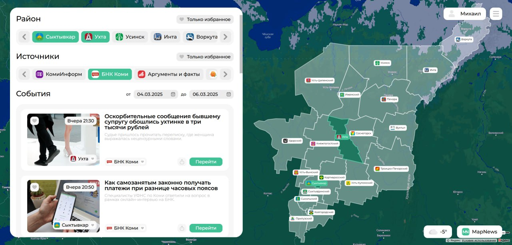

  

<h1 align="center">MapNews</h1>

  

  Агрегация и визуализация новостей с привязкой к географическому положению.  
   
  Обеспечивает удобный доступ к региональным новостям на интерактивной карте.

---

<b>Русская версия</b>

## ⚙️ Архитектура проекта

### Клиентская часть
- Чистый **HTML, CSS, JavaScript**
- Интеграция с **Yandex Map API**
- Отображение новостей по регионам
- Встроенный **Weather API** для отображения текущей погоды
- Интерактивный интерфейс и фильтры

### Серверная часть
- **Node.js** + **Express.js**
- Автоматизированный парсер событий по регионам с новостных источников 
- Подключение к базе данных
- Авторизация и хранение данных о точках (областях, регионах)

### База данных
- Таблицы:
  - `users` — пользователи  
  - `news` — новости  
  - `cities` — районы региона  
  - `sources` — источники  

---

## Технологии
| Категория | Используемые технологии |
|------------|-------------------------|
| Frontend | HTML, CSS, JavaScript |
| API | Yandex Map API, Weather API |
| Backend | Node.js, Express.js |
| Database | MongoDB |

---

<b>English Version</b>

## ⚙️ Project Architecture

### Client Side
- Pure **HTML, CSS, JavaScript**
- Integration with **Yandex Map API**
- Display of regional news on a map
- Built-in **Weather API** for current weather display
- Interactive interface and filters

### Server Side
- **Node.js** + **Express.js**
- Automated event parser for regions from news sources  
- Database connection  
- User authentication and storage of regional points

### Database
- Tables:
  - `users` — users  
  - `news` — news  
  - `cities` — regional districts  
  - `sources` — sources  

---

## Technologies
| Category | Used Technologies |
|------------|------------------|
| Frontend | HTML, CSS, JavaScript |
| API | Yandex Map API, Weather API |
| Backend | Node.js, Express.js |
| Database | MongoDB |

---

